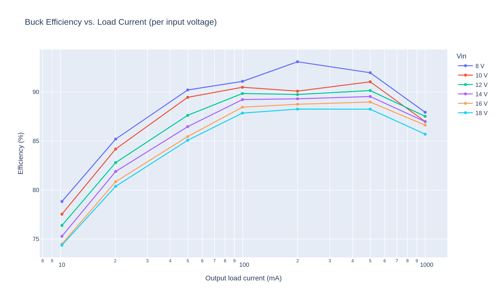
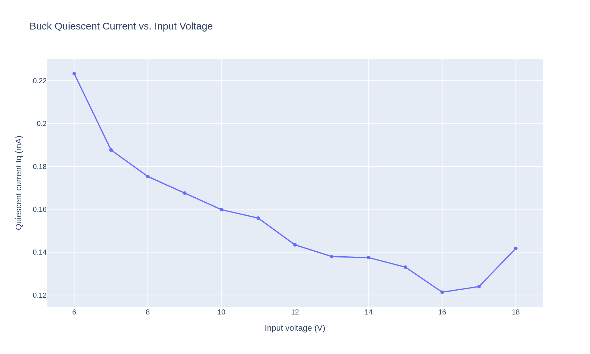
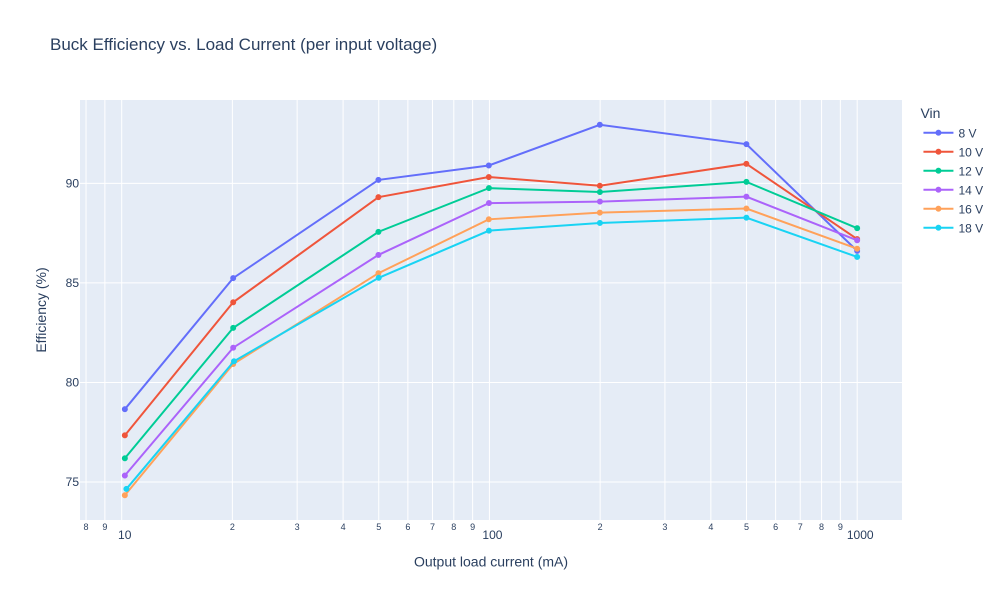
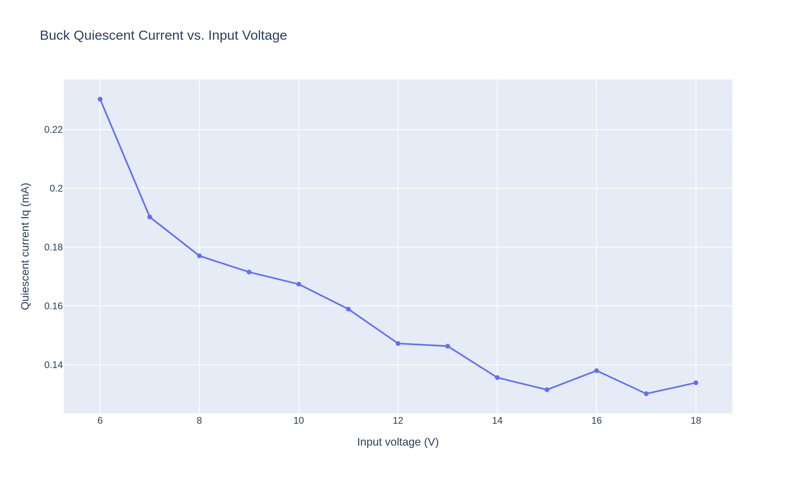
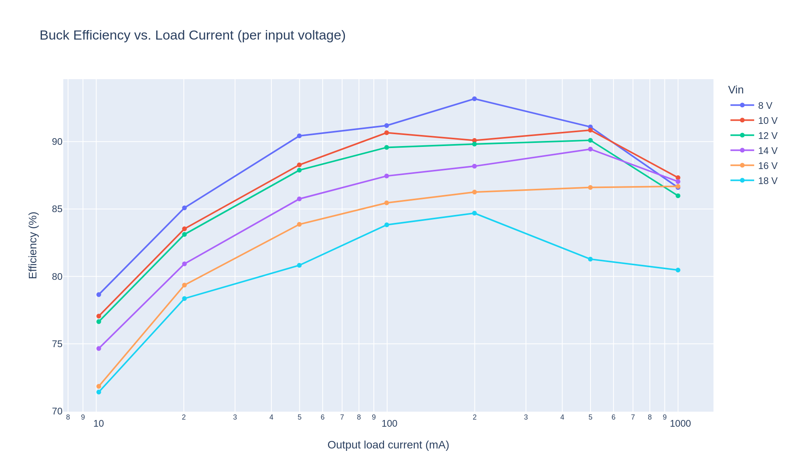
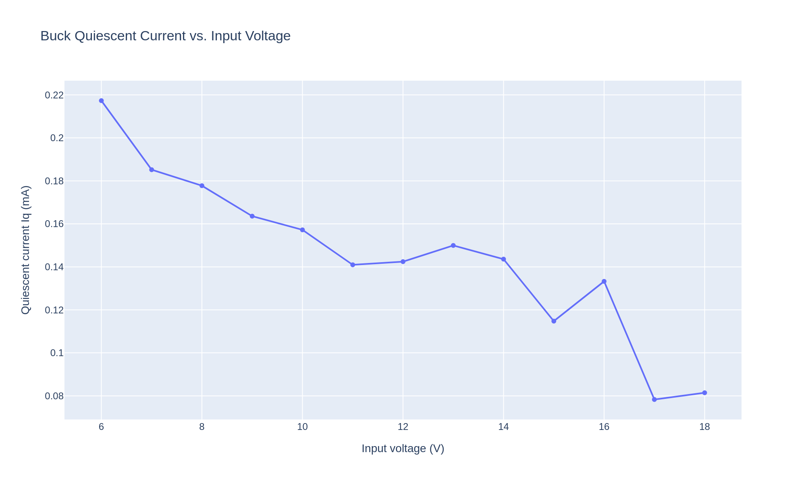

# Testing Cheap MP1584EN 5V Buck Modules

These notes summarize measurements from three samples of this Amazon module:

https://www.amazon.com/dp/B0B779ZYN1

The listing describes it as a fixed 5V MP1584EN buck converter board sold in a
5-pack, with a nominal 5-30V input range and up to 1.8A output.

## Test Summary

Three boards from the same batch were tested from 6-18V input. No-load input
current was measured with a Keysight 34465A DMM, and loaded efficiency was
measured from 10mA to 1A output load.

Iq is in the low hundreds of microamps. Across the three boards it was about
217-230uA with 6V input, falling to about 78-142uA by 18V. The input current is
pulsed, as you'd expect; high-rate DMM captures showed narrow peaks as high as
40mA for <2ms.

Efficiency is generally good for a tiny inexpensive module. Above 50mA load,
the boards were usually in the high 80% range. Two of the three boards matched
closely, averaging about 88.7% efficiency over those points. The third board
was similar at lighter loads and lower input voltages, but was weaker at high
input voltage and heavier load, averaging about 87.4% over the same range.

Output voltage stayed near 5V in normal use. At 1A load, the measured output
voltage across all boards ranged from about 4.79V to 5.20V as long as input was
at least 8V. One board ran noticeably high at high input voltage, so there is
some unit-to-unit variation.

## Plots

|       | Efficiency | Iq |
|-------|------------|----|
| DUT 1 |  |  |
| DUT 2 |  |  |
| DUT 3 |  |  |
