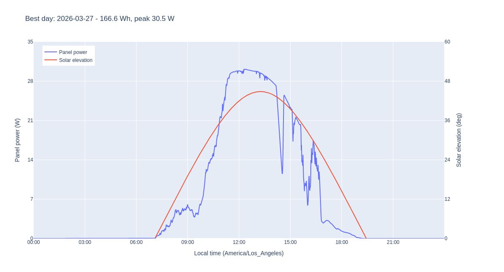
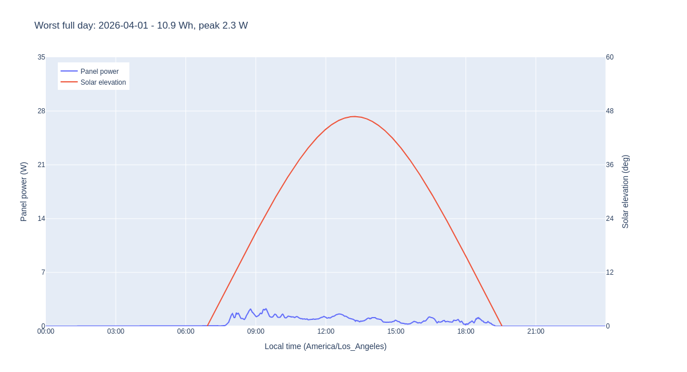

# March-April 2026 Solar Panel Collection Test

This directory archives a long-running spring solar collection test from
March 22-April 7, 2026. The goal was to get a realistic, weather-exposed energy
profile for a small off-grid receiver site rather than relying only on panel
nameplate power.

The test used a [SOLPERK 50 W 12 V solar battery maintainer kit][panel] on a
south-facing balcony, tilted up at about 45 degrees. This is a small rigid
off-grid/trickle-charging kit: a nominal 50 W monocrystalline PV panel paired
with a waterproof 10 A MPPT charge controller and an adjustable mounting bracket,
sold for maintaining 12 V vehicle, RV, marine, and similar batteries. The panel
output passed through that included charge controller and into a GW Instek
GPP-4323 bench supply/electronic load in load mode. The active samples show the
load held almost entirely at **12.5 V** (`12.504-12.505 V` for the bulk of the
run), so the archived power and energy numbers should be read as harvested
output from the kit's controller into an approximately 12.5 V load.

Timestamps below are shown in `America/Los_Angeles`. The solar-elevation overlay
in the figures uses Seattle-ish coordinates, `47.6, -122.33`, matching the live
paneltest web logger. The raw logger data is stored as gzip-compressed CSV.

[panel]: https://www.amazon.com/dp/B0DBQGQYFS

## Archived Run

| Metric | Value |
|---|---:|
| Archived file | `mar23-test.csv.gz` |
| Source CSV | `mar23-test.csv` |
| Start time | 2026-03-22 22:56:18 PDT |
| End time | 2026-04-07 10:35:07 PDT |
| Duration | 15.49 days |
| Samples | 1,320,573 |
| Average sample rate | 0.987 Hz |
| Average sample interval | 1.013 s |
| Total energy | 1464.08 Wh |
| Peak power | 36.28 W |

Earlier March 21-22 files were excluded because they were collected while the
panel position was still being adjusted. The archived file is the stable
long-duration run.

## Daily Energy

| Date | Energy (Wh) | Peak power (W) | Samples | Observed hours |
|---|---:|---:|---:|---:|
| 2026-03-22 | 0.00 | 0.00 | 3,754 | 1.06 |
| 2026-03-23 | 67.56 | 22.65 | 85,412 | 24.00 |
| 2026-03-24 | 19.14 | 17.48 | 85,340 | 24.00 |
| 2026-03-25 | 52.15 | 26.97 | 85,394 | 24.00 |
| 2026-03-26 | 149.36 | 33.57 | 85,494 | 24.00 |
| 2026-03-27 | 166.64 | 30.52 | 85,637 | 24.00 |
| 2026-03-28 | 111.93 | 36.21 | 85,455 | 24.00 |
| 2026-03-29 | 18.53 | 22.01 | 85,705 | 24.00 |
| 2026-03-30 | 164.30 | 33.66 | 85,577 | 24.00 |
| 2026-03-31 | 94.84 | 28.58 | 84,930 | 24.00 |
| 2026-04-01 | 10.86 | 2.28 | 85,279 | 24.00 |
| 2026-04-02 | 69.24 | 35.48 | 84,913 | 24.00 |
| 2026-04-03 | 99.10 | 36.28 | 84,500 | 24.00 |
| 2026-04-04 | 160.65 | 31.09 | 85,220 | 24.00 |
| 2026-04-05 | 132.19 | 28.35 | 85,240 | 24.00 |
| 2026-04-06 | 143.48 | 29.31 | 85,208 | 24.00 |
| 2026-04-07 | 4.11 | 7.09 | 37,515 | 10.59 |

Total collected energy over the archived run is about **1.46 kWh**. Excluding
the partial first and last days, the best day was **2026-03-27** at **166.64 Wh**,
and the worst full day was **2026-04-01** at **10.86 Wh**.

## Example Daily Plots

These static Plotly exports mirror the live paneltest web logger: panel power is
plotted against local time with solar elevation on the secondary axis.

### Best Day: 2026-03-27

### Worst Full Day: 2026-04-01

