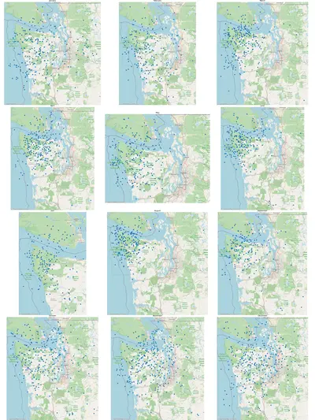

  

    
    
Seattle-area sonde landings tracked by SondeHub, plotted by month, 2021-2023

  

Weather patterns change with the seasons. As prevailing winds change, so do the
typical landing zones of radiosondes. To determine the best times of year for
finding sondes, I created a tool that would draw a "map calendar"---12 small
maps in a grid, one for each month of the year, showing the historical landing
locations of sondes during that month.

In my home town of Seattle, for example, sondes are hard to retrieve. The
nearest launch site is Quillayute, about 100 miles (170km) west, with the
Olympic forest in between. Sondes sometimes make it far enough east to be close
to civilization, but often land in the ocean or deep in inaccessible parts of
the Olympics.

The [Seattle-area
calendar](https://sondesearch.lectrobox.com/vault/calendars/seattle-landings-by-month.webp)
makes it clear that this effect is seasonal. From June to September, sondes
consistently land in the ocean or the forest. We can confidently plan not to
spend time sonde-hunting during the summer here! The best months seem to be
November to January.

You can view these other pre-generated example calendars:

* [Spokane, WA](https://sondesearch.lectrobox.com/vault/calendars/spokane-landings-by-month.webp)
* [Kitchener, Ontario](https://sondesearch.lectrobox.com/vault/calendars/kitchener-landings-by-month.webp)
* [Hilo, Hawaii](https://sondesearch.lectrobox.com/vault/calendars/hilo-landings-by-month.webp)
* [Madison, WI](https://sondesearch.lectrobox.com/vault/calendars/madison-landings-by-month.webp)

 

## Interactive Calendar Generator

Use the map below to pan and zoom to your area of interest, then click "Generate
Calendar" to create a custom landing calendar for any region in the world. If
you prefer to run the calendar-generator on your own computer, the code is
[here](https://github.com/jonhnet/sonde-search/blob/main/analyzers/landings-by-month.py).

<link rel="stylesheet" href="https://unpkg.com/leaflet@1.9.4/dist/leaflet.css" integrity="sha256-p4NxAoJBhIIN+hmNHrzRCf9tD/miZyoHS5obTRR9BMY=" crossorigin=""/>

  <button type="button" id="generate_button" class="ladda-button" data-style="slide-right" onclick="generateCalendar()">Generate Calendar</button>
  

