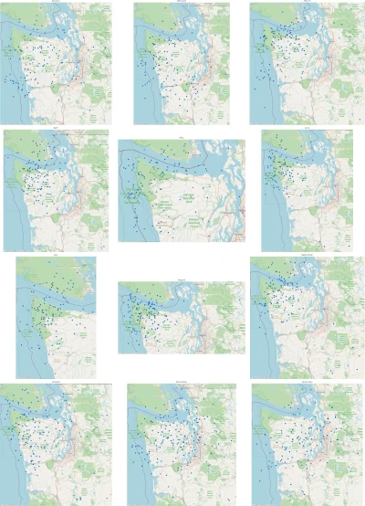

  

    
    
Seattle-area sonde landings tracked by SondeHub, plotted my month, 2021-2023

  

Weather patterns change with the seasons. As prevailing winds change, so do the
typical landing zones of radiosondes. To determine the best times of year for
finding sondes, I created a tool that would draw a "map calendar"---12 small
maps in a grid, one for each month of the year, showing the historical landing
locations of sondes during that month.

In my home of Seattle, for example, sondes are hard to retrieve. The nearest
launch site is Quillayute, about 100 miles (170km) west, with the Olympic forest
in between. Sondes sometimes make it far enough east to be close to
civilization, but often land in the ocean or deep in inaccessible parts of the
Olympics.

The [Seattle-area
calendar](https://sondesearch.lectrobox.com/vault/calendars/seattle-landings-by-month.webp)
makes it clear that this effect is seasonal. From June to September, sondes
consistently land in the ocean or the forest. We can confidently plan not to
spend time sonde-hunting during the summer here! The best months seem to be
November to January.

Currently, this site only has a few example calendars. Coming soon will be an
online generator that will plot a map-calendar for any part of the world you
select. If you're impatient, you can run the mapper yourself: the code is
[here](https://github.com/jonhnet/sonde-search/blob/main/analyzers/landings-by-month.py).

The four examples available are:

* [Seattle, WA](https://sondesearch.lectrobox.com/vault/calendars/seattle-landings-by-month.webp)
* [Spokane, WA](https://sondesearch.lectrobox.com/vault/calendars/spokane-landings-by-month.webp)
* [Kitchener, Ontario](https://sondesearch.lectrobox.com/vault/calendars/kitchener-landings-by-month.webp)
* [Hilo, Hawaii](https://sondesearch.lectrobox.com/vault/calendars/hilo-landings-by-month.webp)
