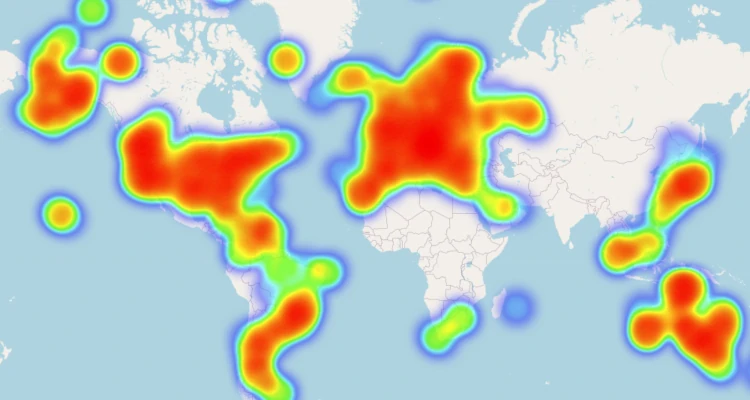

  

    
    
Worldwide sonde landings tracked by SondeHub, 2021-2023

  

  

    
    
U.S. sonde landings tracked by SondeHub, 2021-2023

  

If you're just getting into sonde hunting, it's really useful to know where
sondes typically land. SondeHub shows you where *today's* sonde landed, but is
that typical? I drew heatmaps to answer that question.

Heatmaps are interactive maps showing you the last-tracked location of every
sonde reported to SondeHub from 2021 to 2023. A sonde might land a few miles
from its last-tracked location, but the maps are still a great way to get a
sense for the parts of the world where sondes tend to land.

Click on the thumbnails to the right to see the sonde landing maps for the
entire world and for the US only. The files are large, so some browsers might
have performance issues with the worldwide map.

The source code for generating the heatmaps can be found
[here](https://github.com/jonhnet/sonde-search/blob/main/landing-heatmap/landings-heatmap.py).
The [data](/data) comes from SondeHub's public API, reprocessed into parquet files that are also available for download. The heatmaps are drawn using the
[Folium](https://python-visualization.github.io/folium/latest/) Python library.
